<div align="center">

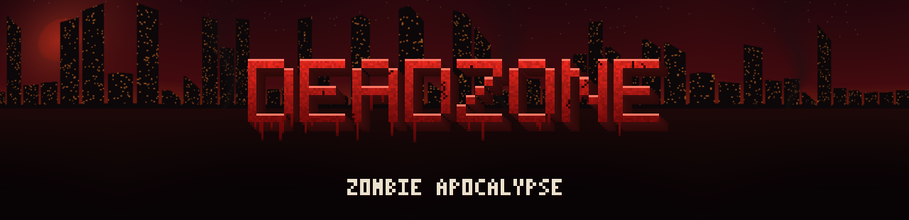

**A lightweight zombie apocalypse overhaul for Minecraft — ruined mega cities, 10 zombie types, 20 guns, infection, secret bunkers and a boss.**

[](https://www.minecraft.net)
[](https://fabricmc.net)
[](https://github.com/xsxs18-dev/DeadZone/releases/latest)
[](https://github.com/xsxs18-dev/DeadZone/actions)
[](LICENSE)

[**Download**](https://github.com/xsxs18-dev/DeadZone/releases/latest) · [Features](#features) · [Installation](#installation) · [Building](#building-from-source)

</div>

<p align="center">
  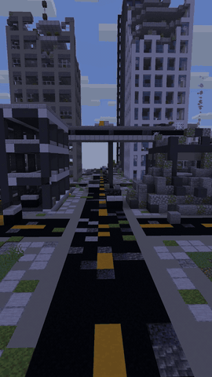
  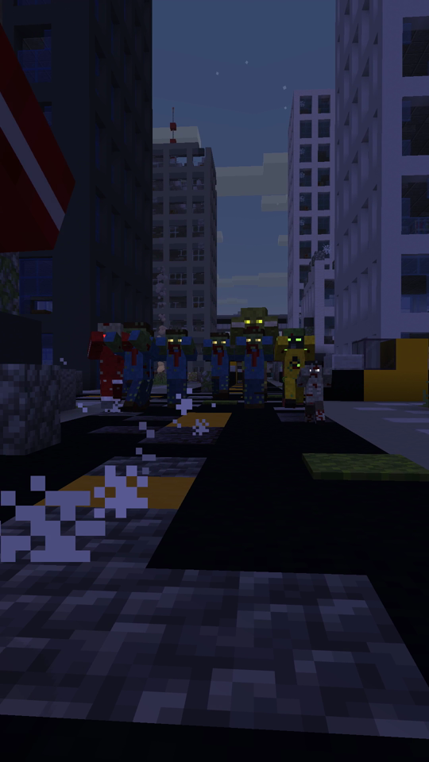
  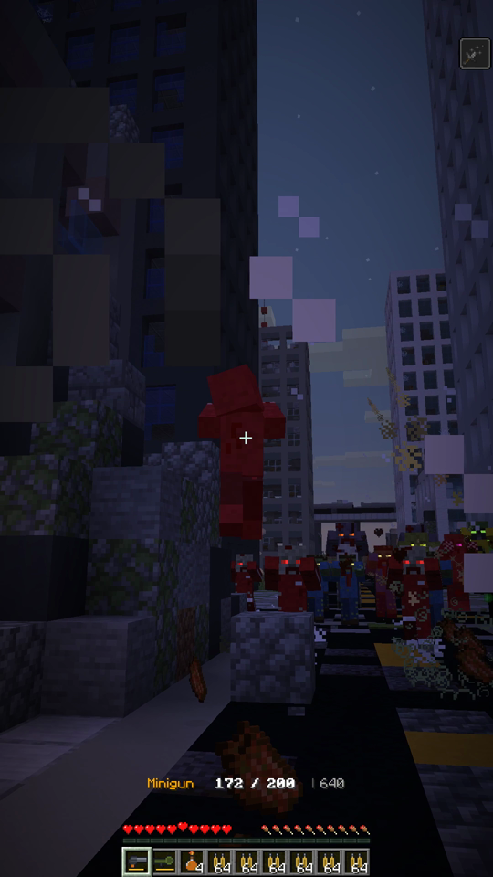
  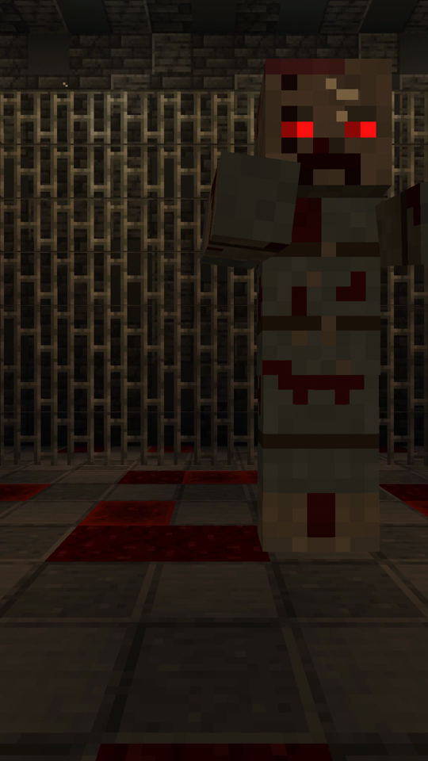
</p>

---

## Features

### 🧟 10 zombie types (+ a boss)

Zombies only spawn **at night**. During the day they are **vulnerable**: they take double damage, slow down and smoke — but they don't burn, so there is no free pass. Every type has its own texture and **glowing eyes** you can spot in the dark.

<p align="center">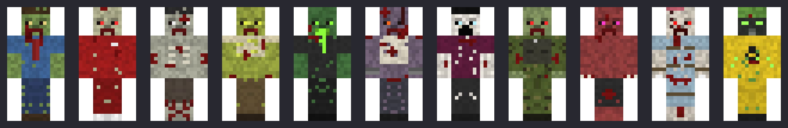</p>

| Zombie | Threat | Special ability |
|---|---|---|
| **Walker** | Low | Comes in large groups, breaks down doors |
| **Runner** | Low | Very fast, spots you from 48 blocks away |
| **Crawler** | Low | Half size, hard to hit, bites slow you down |
| **Bloater** | Medium | Explodes next to you and leaves a poison cloud |
| **Spitter** | Medium | Spits poisonous acid from up to 16 blocks |
| **Brute** | High (80 HP) | Huge, ground slam launches everything into the air |
| **Screamer** | Low | Screams to buff nearby zombies, blinds you and calls reinforcements |
| **Soldier** | High | Helmet and vest, often drops ammo |
| **Leaper** | Medium | Pounces from up to 12 blocks, no fall damage |
| **Toxic** | Medium | Radioactive aura that poisons everything nearby |
| **Patient Zero** *(boss)* | Extreme (300 HP) | Boss bar, ground slam, leap attack, summons runners, enrages below 50 % |

### 🦠 Infection

- Every zombie hit gives you **Weakness for 10 seconds**.
- From the **18th hit** on, every hit has a **12 % chance** to infect you.
- Infected players have **20 minutes** — then they turn into a zombie wearing their own head and die. Milk doesn't help.
- The **Green Antidote** cures the infection. It has an **8 % chance** to appear in any loot chest.
- Defeating Patient Zero drops the **Immune Serum**, which makes you immune forever.

### 🔫 20 guns, knives and throwables

Hitscan weapons — no projectile entities, so even a minigun stays cheap on performance. **Right-click** to shoot, **sneak + right-click** to reload. Sneaking halves the spread, headshots deal ×1.75 damage, and bullets shatter glass. Players hold guns in a proper two-handed aiming pose.

<details>
<summary><b>Full weapon stats</b></summary>

| Weapon | Ammo | Damage | Shots/s | Magazine | Notes |
|---|---|---|---|---|---|
| M9 Pistol | 9mm | 5 | 4 | 15 | |
| .357 Revolver | 9mm | 9 | 1.4 | 6 | |
| Desert Eagle | 9mm | 11 | 1.7 | 7 | |
| Uzi | 9mm | 3.5 | 10 | 25 | Automatic |
| MP5 | 9mm | 4 | 10 | 30 | Automatic |
| P90 | 9mm | 3.5 | 20 | 50 | Automatic |
| AK-47 | 5.56 | 7 | 6.7 | 30 | Automatic |
| M4A1 | 5.56 | 6 | 10 | 30 | Automatic |
| SCAR-H | 5.56 | 8 | 6.7 | 20 | Automatic |
| Marksman Rifle (DMR) | 5.56 | 12 | 2.5 | 10 | Pierces 2 |
| Pump Shotgun | Shells | 8 × 3.5 | 1.1 | 7 | |
| Double-Barrel Shotgun | Shells | 10 × 4 | 2.5 | 2 | |
| AA-12 Auto Shotgun | Shells | 7 × 2.5 | 4 | 20 | Automatic |
| Hunting Rifle | 5.56 | 16 | 0.8 | 5 | Pierces 2 |
| Sniper Rifle | .50 BMG | 28 | 0.6 | 5 | Pierces 3 |
| Barrett .50 | .50 BMG | 40 | 0.8 | 10 | Pierces 5 |
| M249 LMG | 5.56 | 6 | 10 | 100 | Automatic |
| Minigun | 5.56 | 5 | 20 | 200 | Automatic |
| Grenade Launcher | Explosive | — | 1 | 6 | Explosion, no block damage |
| RPG-7 | Explosive | — | 1 | 1 | Explosion, destroys blocks |

</details>

<p align="center">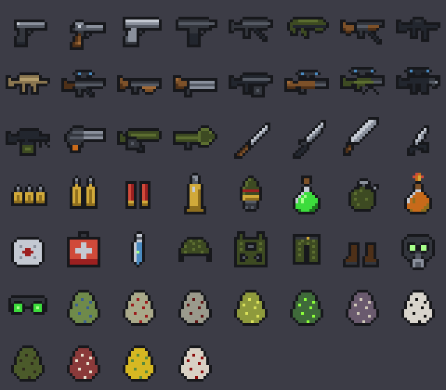</p>

- **Knives:** Kitchen Knife, Combat Knife, Machete, Karambit
- **Throwables:** Frag Grenade, Molotov Cocktail
- **Medical:** Bandage, Medkit, Green Antidote, Immune Serum
- **Gear:** Combat Helmet, Body Armor Vest, Combat Pants, Combat Boots, **Gas Mask** (blocks poison, gas and radiation), **Night Vision Goggles**
- **Ammo:** 9mm, 5.56mm, shotgun shells, .50 BMG and explosive rounds — all craftable

### 🏙️ Ruined world

| Structure | Find it with | What's inside |
|---|---|---|
| **Mega City** | `/locate structure deadzone:metropolis` | ~210 × 210 blocks: skyscrapers up to 90 blocks tall — some intact, some half torn away, some reduced to rubble, some **leaning over the street**. Toppled towers, a collapsed highway, a bomb crater with a helicopter wreck, smoke columns, street lights, barricades, a hospital, police station, gas station, supermarket, parking garage, park with a survivor camp and a military checkpoint |
| **Ruined Town** | `/locate structure deadzone:city` | Streets with car wrecks, collapsed towers, apartments, shops |
| **Secret Bunker** | `/locate structure deadzone:secret_bunker` | Looks like an old shack. Under the moss carpet is a hatch leading 35 blocks down into a research facility: command center, lab with live specimens in glass tubes, weapons vault — and **Patient Zero** |
| **Military Base** | `/locate structure deadzone:military_base` | Walls, watchtowers, barracks, armory, helipad, tents, a tank and a truck |
| **Bunker** | `/locate structure deadzone:bunker` | Underground storage, dorm, lab and armory |
| **Abandoned House** | `/locate structure deadzone:house` | Two-story houses with loot |
| **Tower** | `/locate structure deadzone:tower` | Watchtowers and radio towers |

<p align="center">
  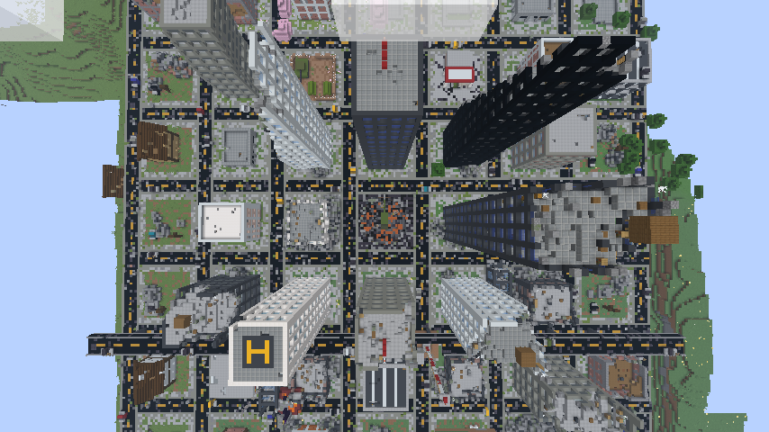
  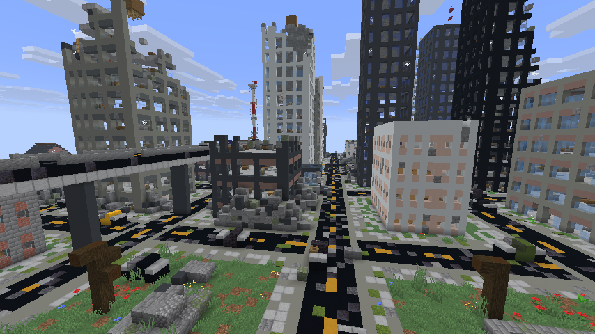
</p>
<p align="center">
  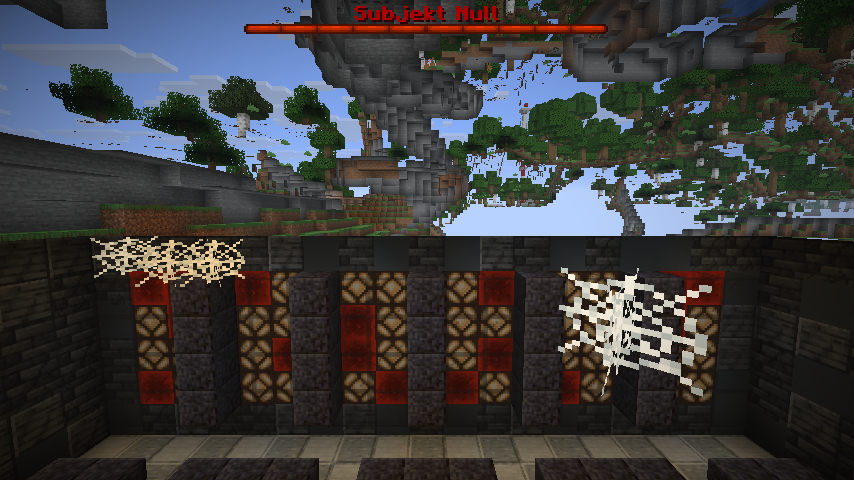
  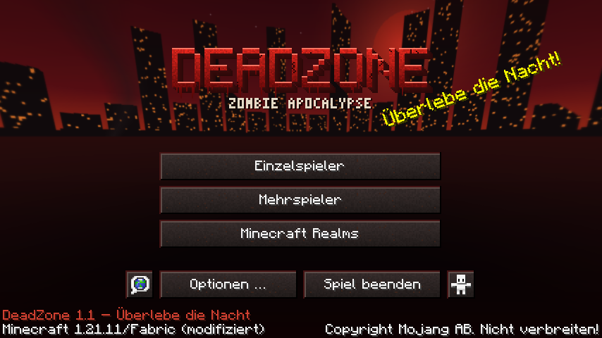
</p>

### 🌕 Blood Moon

Every **7th night** is a Blood Moon. You get a warning, and every 30 seconds a horde marches towards every survival player — capped at 35 zombies per player so it never turns into a slideshow.

### 🎨 New title screen

Custom DEADZONE logo, a blood-moon panorama over a ruined skyline, rust-red buttons and apocalypse splash texts.

### ⚡ Performance

Built to run on low-end PCs: vanilla models, hitscan guns instead of projectiles, abilities on cooldown timers instead of per-tick checks, and procedural structures instead of large NBT files. The whole mod is around **0.5 MB**.

---

## Installation

1. Install [Fabric Loader](https://fabricmc.net/use/) **0.19+** for Minecraft **1.21.11**.
2. Download [Fabric API](https://modrinth.com/mod/fabric-api).
3. Download the latest `deadzone-x.y.z.jar` from [**Releases**](https://github.com/xsxs18-dev/DeadZone/releases/latest).
4. Put both jars into your `.minecraft/mods` folder.

DeadZone is required on **both client and server**. New structures only generate in chunks that haven't been explored yet, so start a new world or travel far.

---

## Building from source

Requirements: **JDK 21+**.

```bash
git clone https://github.com/xsxs18-dev/DeadZone.git
cd DeadZone
./gradlew build          # jar ends up in build/libs/
./gradlew runClient      # start a dev client
```

All textures, the title screen and the data files are generated by scripts, so you can tweak them without an image editor:

```bash
python3 tools/gen_zombies.py   # zombie skins + glowing eyes
python3 tools/gen_items.py     # item textures, effect icon
python3 tools/gen_armor.py     # armor worn on the body
python3 tools/gen_title.py     # logo, panorama, buttons, splashes
python3 tools/gen_data.py      # models, languages, loot tables, recipes, structures
```

<details>
<summary><b>Project layout</b></summary>

```
src/main/java/com/kaan/deadzone/
├── entity/        zombies, boss, grenades & molotovs
├── item/          guns, healing items, gear effects
├── infection/     hit counter, infection timer, cure
├── event/         Blood Moon hordes
├── world/         procedural structures (cities, bunkers, bases)
└── registry/      items, entities, effects, components
src/client/java/   renderers, title screen, aiming pose
tools/             texture & data generators, shorts recorder
```

</details>

---

## License

[MIT](LICENSE) — free to use, modify and include in modpacks.

Not affiliated with Mojang or Microsoft.
